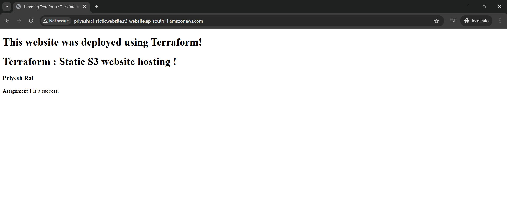

## Assignment 1 – Summary
---
### 1) Initialized a main.tf file with:

Terraform block - AWS provider
Provider block - region and SSO profile
S3 bucket resource for static website
Public access block
S3 object resource to upload index.html

Created an index.html file with simple HTML content

Ran terraform init (initially with local backend)

Verified the configuration with terraform validate
    terraform init
    terraform validate

---
Planned and applied the infrastructure using:
    terraform plan
    terraform apply


#### => Verified the website URL from output
Website URL: ```priyeshrai-staticwebsite.s3-website.ap-south-1.amazonaws.co```


#### => S3 bucket created to hoste static website


---

### 2) Mannually created a S3 bucket : REMOTE BACKEND

#### It stores the tf state file


### 3) Remote Backend Configuration
Created backend.tf file with: S3 bucket as backend for remote state
```
terraform {
    backend "s3" {
        bucket  = "assignmet1-remote-backend"  
        key     = "priyeshterraform/state.tfstate"
        #folder inside bucket - where tfstate file will we saved
        region  = "ap-south-1"
        profile = "AdminAccess-611837361078"
        #sso profile
    }
}

```

Re-ran terraform init

Chose "yes" to copy local state to S3


Verified terraform plan and apply after backend change


Verified:

Website URL works in browser
Website URL: 
```
priyeshrai-staticwebsite.s3-website.ap-south-1.amazonaws.co
```


Assignment completed successfully