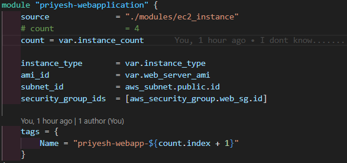

# Assignment 2 - EC2 Module : Summary

## What I did

- Used Terraform to create an EC2 server
- Made a separate folder for module
- Wrote simple code to launch EC2
- Gave inputs like AMI ID, instance type, key name
- Used user_data to install Apache
- Created outputs to show instance info


## Steps I followed

- Wrote code for EC2 in module folder
- Called that module from main file
- Gave values for variables
- Ran terraform commands

## Commands used

- `terraform init` 
- `terraform validate`
- `terraform plan` 
- `terraform apply` 

## Extra work I tried

- Tried to launch **4 EC2 instances** at the same time
- Used **`count`** in the module to create multiple servers
- It worked and created all 4 EC2 instances
- All of them had Apache running with the web page
- code used : 
```
module "priyesh-webapplication" {
    source              = "./modules/ec2_instance"
    # count               = 4
    count = var.instance_count
    
    instance_type       = var.instance_type
    ami_id              = var.web_server_ami
    subnet_id           = aws_subnet.public.id
    security_group_ids  = [aws_security_group.web_sg.id]

    tags = {
        Name = "priyesh-webapp-${count.index + 1}"
    }
}
```



#### 4 ec2 instances created

#### cleanup

#### no instences left


## What I learned

- How to make a Terraform module
- How to pass values to the module
- How to reuse the same code
- Basics of launching EC2 with Terraform

