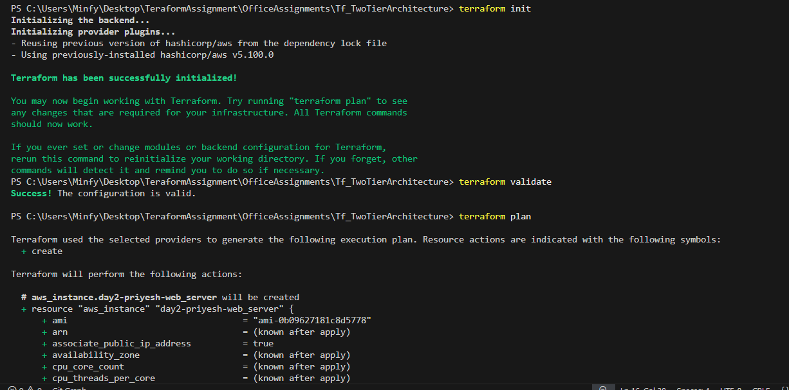

# Assignment 3: S3 Backend + Two-Tier Architecture

## Tasks Performed

### 1. Remote Backend Setup

- Manually created an S3 bucket for remote backend
- Wrote `backend.tf` to use this bucket for storing the state file
- Ran `terraform init` and chose “yes” to copy local state to S3

### 2. Two-Tier Architecture

- Wrote code in `main.tf` to set up:
  - A public subnet with EC2 instance (Web Tier)
  - A private subnet (could be used for database)
  - Internet Gateway and Route Tables
- Created security groups to allow HTTP (port 80) and SSH (port 22)

#### 1st
```
terraform init
terraform vallidate
terraform plan
```

#### 2nd
```
terraform apply
```


 - website hosted on `https://52.66.64.104/`

#### 3rd ec2 instance running


#### 4th vpc


#### 5th cleanup 


#### 6th cleanup
