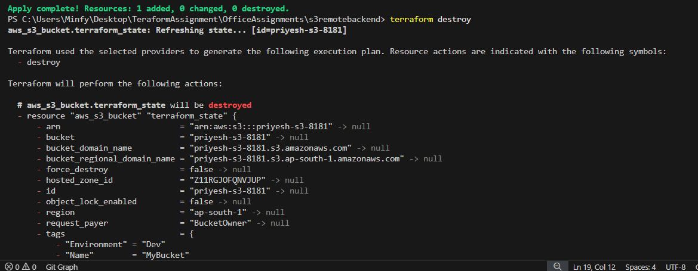

# Assignment 2: EC2 Web Server with Reusable Module

- module/
  - main.tf
  - variables.tf
  - outputs.tf
- main.tf
- output.tf
- providers.tf
- terraform.tfvars

### website hosted

### remote backend and the s3 bucket together

### cleanup
